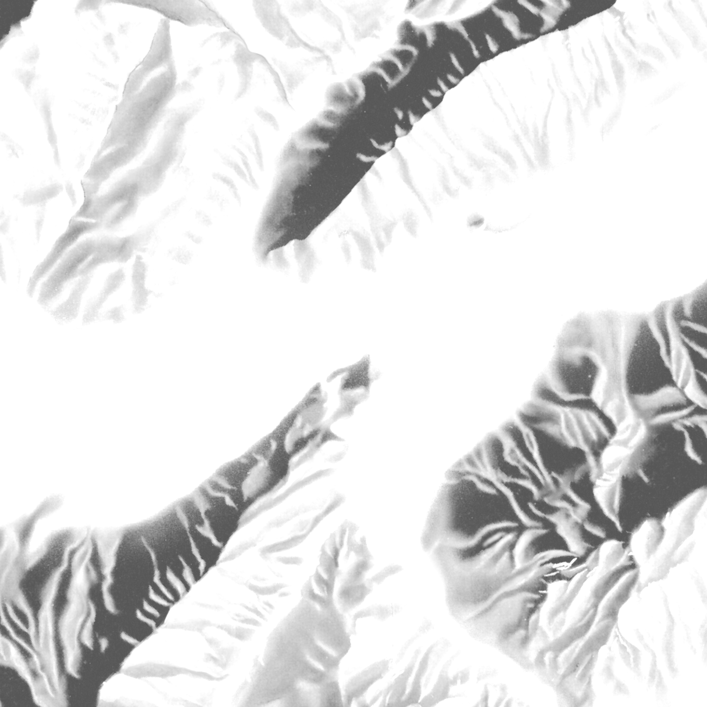

# Swisstopo Vector Hillshade

Use hand-drawn hillshading layers from Swisstopo to generate vector hillshading in MapLibre GL JS.

## Demo

### Hillshade Only

https://wipfli.github.io/swisstopo-vector-hillshade

<a href="https://wipfli.github.io/swisstopo-vector-hillshade">
    
</a>

### Hillshade and Swissmap Overlay

https://wipfli.github.io/swisstopo-vector-hillshade/swissmap

<a href="https://wipfli.github.io/swisstopo-vector-hillshade/swissmap">
    
</a>

### Hillshade and swisstopo Light Base Map Overlay

https://wipfli.github.io/swisstopo-vector-hillshade/swisstopo

<a href="https://wipfli.github.io/swisstopo-vector-hillshade/swisstopo">
    
</a>

## Source Data

Based on data from swisstopo. Usage terms see https://www.swisstopo.admin.ch/en/home/meta/conditions/geodata/ogd.html. See Downloads for links to the Swiss Map Raster maps.

### SMR100_LV95_GTON_Mosaic.tif: Gelbton (yellow tone)

Color: `rgb(255, 255, 228)`

Opacity mask:



### SMR100_LV95_RELI_Mosaic.tif: Relief (relief)

Color: `rgb(173, 188, 199)`

Opacity mask:


These opacity masks were hand-drawn I think by Swiss cartographers in the past...


## Vectorization with GDAL

```
python3 script.py
python3 merge.py
```

## Tippecanoe

```
python3 tiles.py
```

## Downloads

Raster Source SMR1000: https://pub-726b01260c98468a9387cc0dfcb7386b.r2.dev/SMR1000.zip (314 MB)

Raster Source SMR500: 

Resulting MBTiles file: https://pub-726b01260c98468a9387cc0dfcb7386b.r2.dev/swisstopo-vector-hillshade.mbtiles (757 MB)
