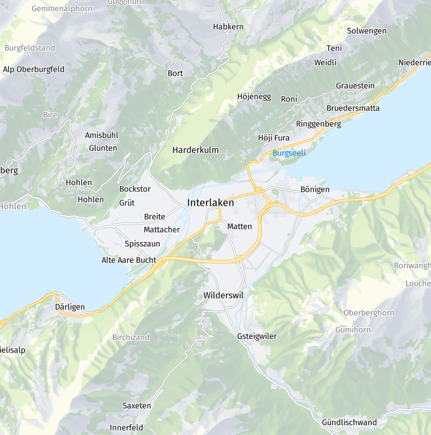

# Swisstopo Vector Hillshade

Use hand-drawn hillshading layers from Swisstopo to generate vector hillshading in MapLibre GL JS.

## Demo

### Hillshade Only

https://wipfli.github.io/swisstopo-vector-hillshade

### Hillshade and Swissmap Overlay

https://wipfli.github.io/swisstopo-vector-hillshade/swissmap

## Source Data

Download sample data from [swisstopo](https://www.swisstopo.admin.ch/de/geodata/maps/smr/smr100.html).

The file contains raster files for the different layers of the swisstopo map. We use the following layers:

### SMR100_LV95_WTON_Mosaic.tif Waldton (forest tone)

Color: `rgb(205, 230, 190)`

Opacity mask:

### SMR100_LV95_GTON_Mosaic.tif: Gelbton (yellow tone)

Color: `rgb(255, 255, 228)`

Opacity mask:

### SMR100_LV95_RELI_Mosaic.tif: Relief (relief)

Color: `rgb(173, 188, 199)`

Opacity mask:

These opacity masks were hand-drawn I think by Swiss cartographers in the past...

## Vectorization with QGIS

The masks have 255 grayscale levels, we group them into bins and vectorize them in QGIS with

* import gton raster in qgis
* set raster layer crs to LV95
* reclassify by table
* set thresholds to 0 - 200 -> 200, 200 - 255 -> 255
* polygonize
* extract by expression
* DN = 200 and $area > 5000 
* simplify douglas peucker tolerance 50
* export layer as geojson save as gton-200.geojson

similar for RELI, and WTON
